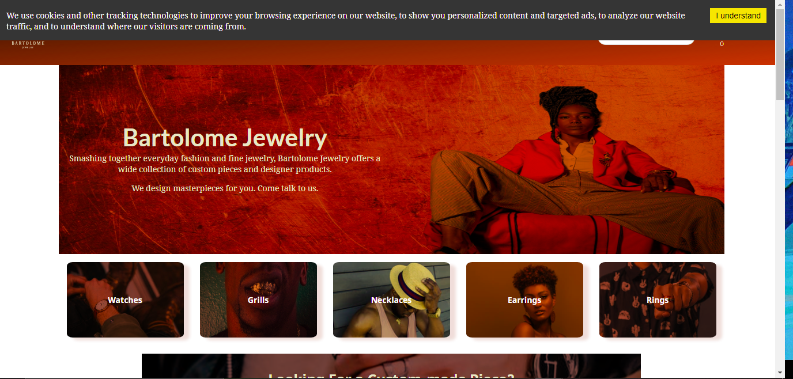
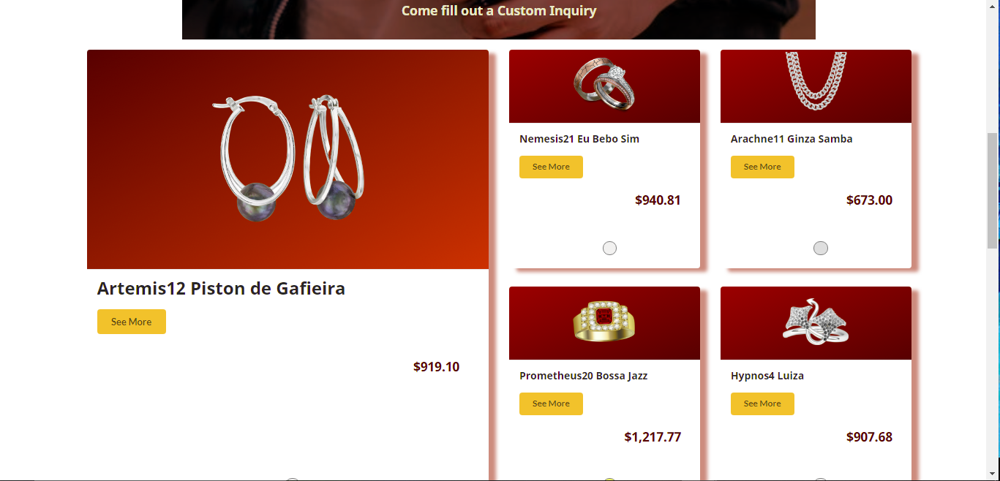

# Bartolome Jewelry - Front End

<p>
Bartolome Jewelry is a a progressive eCommerce application for a boutique jewelry business aimed at a modern audience with an inclusive brand. A application is able to search the API for items, allow users to send the vendor inquiries for custom jewelry, connect to a Stripe API to collect card information, and track user's actions through Google Analytics.
</p>

 Here is the link to the [back end](https://github.com/luisreyesxv/jewelry-store-back).





---

## Libraries used

* [lodash.debounce](https://github.com/lodash/lodash) v4.0.8
* [react-cookie-consent](https://github.com/Mastermindzh/react-cookie-consent) v6.2.3
* [react-ga](https://github.com/react-ga/react-ga) v3.3.0
* [semantic-ui](https://github.com/Semantic-Org/Semantic-UI) "^2.0.3"
* [react-stripe-elements](https://github.com/stripe/react-stripe-elements) v6.1.2

---

## Environment Variables
<p>
This build uses a few environment variables that you nee dto make sure you set up. For your development environment, I recommend you create a .env.development file and insert the variables in this file.

The variables are as follows:

| **Variable**   | **Purpose** |
|----------------|-------------|
| REACT_APP_API_URL | This is the URL for the backend API. (ie. `https://example.com/` )     |
| REACT_APP_TITLE        | The name of the eCommerce Business. This will be sprinkled throughout the application including document title, menu, etc.      |
| REACT_APP_STRIPE_KEY          | the public key for your Stripe API account     |
| REACT_APP_GA_TRACKING_ID          | The tracking ID for Google Analytics (ie `UA-XXXXXXXXX-X`)     |

---

## Miscellaneous

* Each item has a button representing what material it is made of. The colors for the Material buttons are inside ```/Component/Materials/MaterialButtons.js```. The import for this information is sprinkled throughout. Currently, the colors are simple representing the simple materials, but this will be handy to change if you ever have to show multile colors/designs at once (like Red/Green, or Zebra)

* The category names and respective images are found inside ```/Component/categories.js``` . Each object needs the following properties


    | **Property**   | **Purpose** |
    |----------------|-------------|
    | text | The string that will be displayed in links or cards     |
    | link | If the category element is a link, it will direct to what is here     |
    | img | This is primarily used by inquiries and category cards on homepage. This is the image for the respective property.   |




# Credits for Outside Assets
**404 SVGs** are from  <a href="https://storyset.com/web">Illustration by Freepik Storyset</a> 

**Homepage category credits**

* Watch Photo by <a href="https://burst.shopify.com/@thenomadbrodie?utm_campaign=photo_credit&amp;utm_content=Free+Tying+Up+Boot+Laces+Photo+%E2%80%94+High+Res+Pictures&amp;utm_medium=referral&amp;utm_source=credit">Brodie Vissers</a> from <a href="https://burst.shopify.com/tie?utm_campaign=photo_credit&amp;utm_content=Free+Tying+Up+Boot+Laces+Photo+%E2%80%94+High+Res+Pictures&amp;utm_medium=referral&amp;utm_source=credit">Burst</a>
* Ring Photo by <a href="https://burst.shopify.com/@shopifypartners?utm_campaign=photo_credit&amp;utm_content=Free+Stock+Photo+of+Fist+With+Pride+Ring+%E2%80%94+HD+Images&amp;utm_medium=referral&amp;utm_source=credit">Shopify Partners</a> from <a href="https://burst.shopify.com/ring?utm_campaign=photo_credit&amp;utm_content=Free+Stock+Photo+of+Fist+With+Pride+Ring+%E2%80%94+HD+Images&amp;utm_medium=referral&amp;utm_source=credit">Burst</a>
* Grills Photo by  <a href="https://www.toothologydental.com/grills-history/"> Toothology Dental </a>
* Custom Work Inquiry Banner Photo by <a href="https://burst.shopify.com/@ndekhors?utm_campaign=photo_credit&amp;utm_content=Picture+of+Mens+Watch+%26+Ring+-+Free+Stock+Photo&amp;utm_medium=referral&amp;utm_source=credit">Nicole De Khors</a> from <a href="https://burst.shopify.com/watch?utm_campaign=photo_credit&amp;utm_content=Picture+of+Mens+Watch+%26+Ring+-+Free+Stock+Photo&amp;utm_medium=referral&amp;utm_source=credit">Burst</a>


**Jewelry Credits**

* All images of grills come from [King Johnny (Johnnys Custom Jewelry)](https://johnnyscustomjewelry.com/grillz/)
* Most images of rings come from [My Trio Rings](https://www.mytriorings.com/)
* Most images of necklaces come from [King Ice](https://www.kingice.com/)
* Most images of earrings come from [Ross-Simmons](https://www.ross-simons.com/)


Every other image else (not jewelry)  comes from Nappy.co

**Inquiry List credits**

* Repair Inquiry Photo by <a href="https://burst.shopify.com/@matthew_henry?utm_campaign=photo_credit&amp;utm_content=Browse+Free+HD+Images+of+Using+a+Rotary+Tool+On+Jewelry&amp;utm_medium=referral&amp;utm_source=credit">Matthew Henry</a> from <a href="https://burst.shopify.com/tools?utm_campaign=photo_credit&amp;utm_content=Browse+Free+HD+Images+of+Using+a+Rotary+Tool+On+Jewelry&amp;utm_medium=referral&amp;utm_source=credit">Burst</a>

Every other image else (not jewelry)  comes from Nappy.co


---


# Getting Started with Create React App

This project was bootstrapped with [Create React App](https://github.com/facebook/create-react-app).

## Available Scripts

In the project directory, you can run:

### `npm start`

Runs the app in the development mode.\
Open [http://localhost:3000](http://localhost:3000) to view it in the browser.

The page will reload if you make edits.\
You will also see any lint errors in the console.

### `npm test`

Launches the test runner in the interactive watch mode.\
See the section about [running tests](https://facebook.github.io/create-react-app/docs/running-tests) for more information.

### `npm run build`

Builds the app for production to the `build` folder.\
It correctly bundles React in production mode and optimizes the build for the best performance.

The build is minified and the filenames include the hashes.\
Your app is ready to be deployed!

See the section about [deployment](https://facebook.github.io/create-react-app/docs/deployment) for more information.

### `npm run eject`

**Note: this is a one-way operation. Once you `eject`, you can’t go back!**

If you aren’t satisfied with the build tool and configuration choices, you can `eject` at any time. This command will remove the single build dependency from your project.

Instead, it will copy all the configuration files and the transitive dependencies (webpack, Babel, ESLint, etc) right into your project so you have full control over them. All of the commands except `eject` will still work, but they will point to the copied scripts so you can tweak them. At this point you’re on your own.

You don’t have to ever use `eject`. The curated feature set is suitable for small and middle deployments, and you shouldn’t feel obligated to use this feature. However we understand that this tool wouldn’t be useful if you couldn’t customize it when you are ready for it.

## Learn More

You can learn more in the [Create React App documentation](https://facebook.github.io/create-react-app/docs/getting-started).

To learn React, check out the [React documentation](https://reactjs.org/).

### Code Splitting

This section has moved here: [https://facebook.github.io/create-react-app/docs/code-splitting](https://facebook.github.io/create-react-app/docs/code-splitting)

### Analyzing the Bundle Size

This section has moved here: [https://facebook.github.io/create-react-app/docs/analyzing-the-bundle-size](https://facebook.github.io/create-react-app/docs/analyzing-the-bundle-size)

### Making a Progressive Web App

This section has moved here: [https://facebook.github.io/create-react-app/docs/making-a-progressive-web-app](https://facebook.github.io/create-react-app/docs/making-a-progressive-web-app)

### Advanced Configuration

This section has moved here: [https://facebook.github.io/create-react-app/docs/advanced-configuration](https://facebook.github.io/create-react-app/docs/advanced-configuration)

### Deployment

This section has moved here: [https://facebook.github.io/create-react-app/docs/deployment](https://facebook.github.io/create-react-app/docs/deployment)

### `npm run build` fails to minify

This section has moved here: [https://facebook.github.io/create-react-app/docs/troubleshooting#npm-run-build-fails-to-minify](https://facebook.github.io/create-react-app/docs/troubleshooting#npm-run-build-fails-to-minify)
